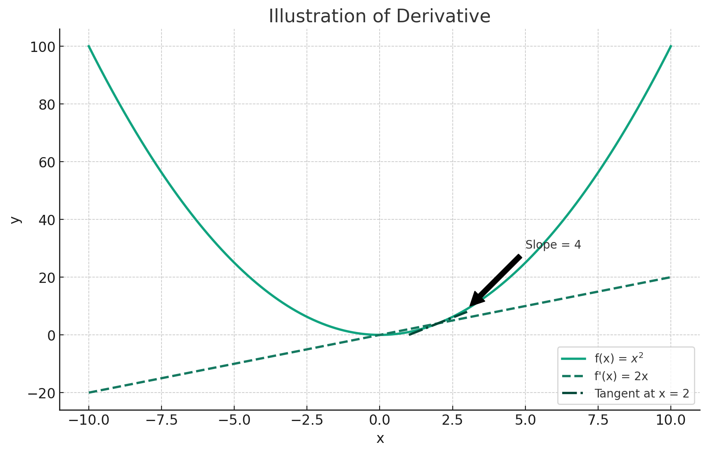
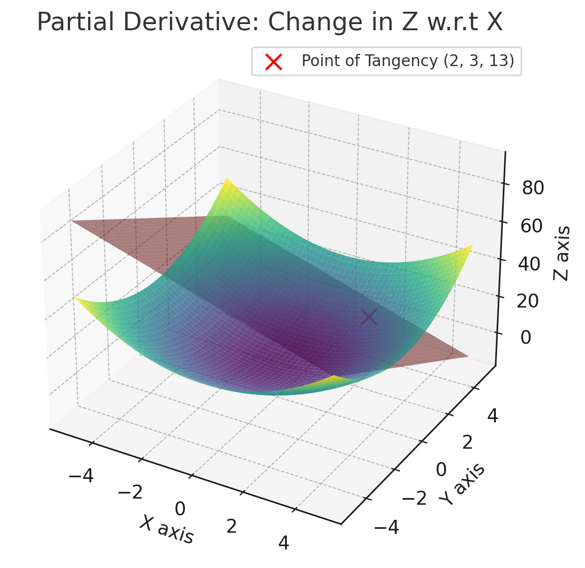

# Math For Machine Learning 1

This article will review the various bits of math required for fully grasping
what is happening in the [Multi-layered Perceptron (MLP)](./perceptron.md) 
chapter. The MLP will form the foundation for the other chapters in this book
but purposefully glosses over some of the mathematics to help the reader fully grasp
conceptually what is happening in the perceptron code without getting lost in
the mechanics of partial derivatives and matrix transformations.

However, in order to really progress in the field and to be able to digest and more
importantly, debug some of the issues that arise in the field and an understanding of the 
math is important. 

Notably, this will cover the math from the MLP chapter. As we encounter new concepts
in the other chapters, we will introduce additional mathematics chapters separately
from our implementations so that they can be referred to after an initial intuition
is made.

## MSE - Mean Squared Error

In our perceptron model, we employ the concept of Mean Squared Error (MSE) to quantify the network's loss. By "loss," we refer to the discrepancy between a given prediction and the actual, or true, value.

Mathematically, the MSE is defined as:

$$\[
\text{MSE} = \frac{1}{n} \sum_{i=1}^{n} (y_{\text{true}, i} - y_{\text{pred}, i})^2
\]$$

Where $$\( n \)$$ is the number of samples.

In Python, this formula can be implemented as follows:

```python
@staticmethod
def mse(y_true, y_pred):
    return np.mean((y_true - y_pred) ** 2)
```

Here's a quick example to illustrate the calculation:

```python
>>> y_true = [5, 6, 7, 8]  # Desired result
>>> y_pred = [10, 6, 4, 8] # Predicted result
>>> (np.array(y_true) - y_pred) # Differences
array([-5,  0,  3,  0])
>>> (np.array(y_true) - y_pred) ** 2 # Squaring the differences
array([25,  0,  9,  0])
>>> np.mean((np.array(y_true) - y_pred) ** 2) # Mean of squared differences
8.5
```

### Breaking Down the Equation Components

Let's break down the components of the MSE formula for a deeper understanding:

- $\( \text{MSE} \)$: This is the Mean Squared Error, which serves as a measure of how well the model's predictions match the true values.
  
- $\( \frac{1}{n} \)$: This part represents the average. We sum up all the squared differences and then divide by $\( n \)$, the number of samples, to get an average.

- $\( \sum_{i=1}^{n} \)$: This is the summation notation, indicating that we sum up the squared differences for each sample from $\( i = 1 \) to \( n \)$.

- $\( (y_{\text{true}, i} - y_{\text{pred}, i})^2 \)$: This part calculates the squared difference between the true value $\( y_{\text{true}, i} \)$ and the predicted value $\( y_{\text{pred}, i} \)$ for each sample $\( i \)$.

By understanding each component, you can better appreciate how MSE provides a comprehensive measure of the model's performance. It squares the differences to eliminate negative values, sums them up, and then averages them to get a single value that can be minimized during the training process.

## Expanding Squares

We'll need to understand this to understand some of the rules around derivatives in just a moment.

The expression $\((x - y)^2\) is shorthand for \((x - y) \times (x - y)\). When you multiply these two binomials, you apply the distributive property, also known as the FOIL (First, Outer, Inner, Last) method in this context.

Here's how it works, step by step:

1. **First**: Multiply the first terms in each binomial: $\(x \times x = x^2\)$
2. **Outer**: Multiply the outer terms in the product: $\(x \times (-y) = -xy\)$
3. **Inner**: Multiply the inner terms: $\(-y \times x = -xy\)$
4. **Last**: Multiply the last terms: $\(-y \times -y = y^2\)$

Now, sum these up: $\(x^2 + (-xy) + (-xy) + y^2\)$

Combine like terms: $\(x^2 - 2xy + y^2\)$

So, $\((x - y)^2 = x^2 - 2xy + y^2\)$

## Derivatives

Imagine driving a car on a hilly road. The derivative would tell you how steep the hill is at each point. If the derivative is zero, you're at a flat point, possibly the top or bottom of a hill. It is basically the rate of change. You can also imagine it as a tangent line drawn against a curve. This rate of change lets us understand the direction of our loss and thereby adjust our network weights in the other direction to get better results.



### Basic Derivative Rules

1. **Constant Rule**: The derivative of a constant is zero. If you have a constant number like 5, it doesn't change, so its rate of change (derivative) is zero.

   $$\[
   \frac{d}{dx}(c) = 0
   \]$$
   
2. **Power Rule**: The derivative of \( x^n \) is \( n \times x^{n-1} \). This rule allows you to find the derivative of any power of \( x \).

   \[
   \frac{d}{dx}(x^n) = n \times x^{n-1}
   \]


## Partial Derivative and Gradients

In multivariable calculus, when a function depends on more than one variable, we use partial derivatives. A partial derivative with respect to one variable tells us how the function changes with respect to that variable, keeping all other variables constant.

### Intuition

Let's say you're playing minecraft, and you're in a mountain range. The mountains extend and descend in different directions. Depending on the direction you move in, you might move up or down. In a Minecraft mountain range, each point in the terrain can be represented by coordinates $\( (x, y, z) \)$, where $\( x \)$ and $\( y \)$ are the horizontal coordinates and $\( z \)$ is the elevation. 

If you're standing at a particular point $\( (x_0, y_0, z_0) \)$, a partial derivative with respect to $\( x \)$ would tell you how much the elevation $\( z \)$ changes as you move in the $\( x \)$-direction, while keeping $\( y \)$ constant. Similarly, the partial derivative with respect to $\( y \)$ would tell you how $\( z \)$ changes as you move in the $\( y \)$-direction, keeping $\( x \)$ constant.

So, if $\( \frac{\partial z}{\partial x} \)$ is positive at $\( (x_0, y_0, z_0) \)$, it means that moving in the positive $\( x \)$-direction will increase your elevation, i.e., you'll be moving uphill. If it's negative, you'll be moving downhill. The same logic applies for $\( \frac{\partial z}{\partial y} \)$.

In the context of neural networks, each weight and bias can be thought of as a coordinate in a high-dimensional space, and the partial derivatives help us understand how the error changes as we tweak each of these parameters.



Certainly, adding a section on gradients under "Partial Derivatives" can enhance the understanding of the topic. Here's how you could revise that section:

### Gradients: The Vector of Partial Derivatives

The concept of a gradient is fundamental when dealing with functions of multiple variables. The gradient is simply a vector that contains all the partial derivatives of a function. For a function \( f(x, y, z) \), the gradient \( \nabla f \) would be:

$$\[
\nabla f = \left[ \frac{\partial f}{\partial x}, \frac{\partial f}{\partial y}, \frac{\partial f}{\partial z} \right]
\]$$

#### Understanding the Gradient

Think of the gradient as a direction in which the function increases most rapidly. If you're standing on a hillside represented by the function $\( f(x, y, z) \)$, and you take a step in the direction of the gradient, you'll move in the direction where the elevation increases the most. Conversely, if you move in the opposite direction of the gradient, you'll find yourself going downhill most quickly.

#### Importance in Machine Learning

In the context of neural networks, the gradient helps us know the direction and magnitude by which each parameter (weights and biases) should be updated during the training process. It essentially points us in the direction in which the error function is increasing the most, allowing us to adjust the parameters in the opposite direction to minimize the error.

### Common Rules for Partial Derivatives

1. **Constant Rule**: The partial derivative of a constant is zero. This is similar to the constant rule for regular derivatives.

   $$\[
   \frac{\partial}{\partial x}(c) = 0
   \]$$
   
2. **Power Rule**: The partial derivative of $\( x^n \)$ with respect to $\( x \)$ is $\( n \times x^{n-1} \)$. This is the same as the power rule for regular derivatives.

   $$\[
   \frac{\partial}{\partial x}(x^n) = n \times x^{n-1}
   \]$$

3. **Sum Rule**: The partial derivative of a sum is the sum of the partial derivatives.

   $$\[
   \frac{\partial}{\partial x}(f + g) = \frac{\partial f}{\partial x} + \frac{\partial g}{\partial x}
   \]$$
   
4. **Product Rule**: The partial derivative of a product $\( f \times g \)$ is:
   
   $$\[
   \frac{\partial}{\partial x}(f \times g) = f \times \frac{\partial g}{\partial x} + g \times \frac{\partial f}{\partial x}
   \]$$

5. **Chain Rule**: This is a bit more complex and is crucial for neural networks. If $\( z \)$ is a function of $\( y \)$, and $\( y \)$ is a function of $\( x \)$, then:

   $$\[
   \frac{\partial z}{\partial x} = \frac{\partial z}{\partial y} \times \frac{\partial y}{\partial x}
   \]$$


### Derivative of the Loss Function (aka the derivative of MSE)

Let's consider your loss function $\( L \)$:

$\[
L = (y_{\text{pred}} - y_{\text{true}})^2
\]$

First, we'll expand this square (see above for an explanation):

$\[
L = y_{\text{pred}}^2 - 2y_{\text{pred}}y_{\text{true}} + y_{\text{true}}^2
\]$

Now, we'll find the derivative of $\( L \)$ with respect to $\( y_{\text{pred}} \)$, denoted as $\( \frac{\partial L}{\partial y_{\text{pred}}} \)$.

### Breaking Down the Loss Function

The loss function $\( L \)$ is a composite of several terms:

$$\[
L = y_{\text{pred}}^2 - 2y_{\text{pred}}y_{\text{true}} + y_{\text{true}}^2
\]$$

To find out how $\( L \)$ changes with $\( y_{\text{pred}} \)$, we need to consider how each term in $\( L \)$ changes with $\( y_{\text{pred}} \)$. That's why we take the partial derivative of each term with respect to $\( y_{\text{pred}} \)$.

### Sum Rule in Calculus

In calculus, the sum rule states that the derivative of a sum is the sum of the derivatives. Therefore, after finding the partial derivatives of individual terms, we sum them up to get $\( \frac{\partial L}{\partial y_{\text{pred}}} \)$.

As such the terms are:

1. **First term \( y_{\text{pred}}^2 \)**: Using the power rule, the derivative is \( 2 \times y_{\text{pred}} \).

2. **Second term \( -2y_{\text{pred}}y_{\text{true}} \)**: \( y_{\text{true}} \) is a constant with respect to \( y_{\text{pred}} \), so the derivative is \( -2 \times y_{\text{true}} \).

This one is weird. What do we mean `ytrue` is constant? This is because `ytrue` is the actual value we're trying to predict, and it doesn't change as we tweak our model parameters.Let's say $\( y_{\text{true}} = 3 \)$.

The term becomes $\( -2y_{\text{pred}} \times 3 \)$ or $\( -6y_{\text{pred}} \)$.

Now, if we take the partial derivative of $\( -6y_{\text{pred}} \$ with respect to $\( y_{\text{pred}} \)$, we get $\( -6 \)$, which is the same as $\( -2 \times y_{\text{true}} \)$ (since $\( y_{\text{true}} = 3 \)$).

3. **Third term \( y_{\text{true}}^2 \)**: This term doesn't involve \( y_{\text{pred}} \), so its derivative is zero.

Adding these up, we get:

\[
\frac{\partial L}{\partial y_{\text{pred}}} = 2y_{\text{pred}} - 2y_{\text{true}}
\]

## Putting it together
In a fully connected layer, the weighted sum $\( z \)$ for a neuron is calculated as:

$$\[
z = w \times x + b
\]$$

Here, $\( x \)$ is the activation output from the neurons in the previous layer. During backpropagation, this $\( x \)$ is used to update the weight $\( w \)$ as follows:

$\[
\frac{\partial L}{\partial w} = \delta \times x
\]$

In our mlp Python code, this would correspond to the line:

```python
grad_weights[-1] = np.dot(delta, activations[-2].T)
```

Here, `activations[-2]` would be $\( x \)$, the activation output from the previous layer, and `delta` is the error term calculated as `2 * (y_pred - y_true) * self.activation_derivative(zs[-1])`.

The bias term acts as an offset that allows the neuron to have some flexibility in fitting the data. When you're updating the bias during backpropagation, you're essentially asking, "How much does a small change in this bias term affect my loss?"

In a neuron, the weighted sum $\( z \)$ is again calculated as:

$\[
z = w \times x + b
\]$

When you take the partial derivative of $\( z \)$ with respect to the bias $\( b \)$, you get:

$\[
\frac{\partial z}{\partial b} = 1
\]$

This is because the bias term $\( b \)$ is added directly to the weighted sum $\( z \)$, without being multiplied by any variable. Therefore, a small change in $\( b \)$ would result in an equivalent change in $\( z \)$.

### Backpropagation Context

In backpropagation, you're interested in how much the loss $\( L \)$ changes with respect to $\( z \)$, which is denoted as $\( \delta \)$ (the error term). Since $\( \frac{\partial z}{\partial b} = 1 \)$, the change in the loss $\( L \)$ with respect to the bias $\( b \)$ is the same as the change in $\( L \)$ with respect to $\( z \)$. Mathematically, this is expressed as:

$$\[
\frac{\partial L}{\partial b} = \delta \times 1 = \delta
\]$$

In our MLP Python code, this is reflected in the line:

```python
grad_biases[-1] = delta
```

Here, `grad_biases[-1]` is the gradient of the loss with respect to the bias for the last layer, and it's set equal to `delta`.


